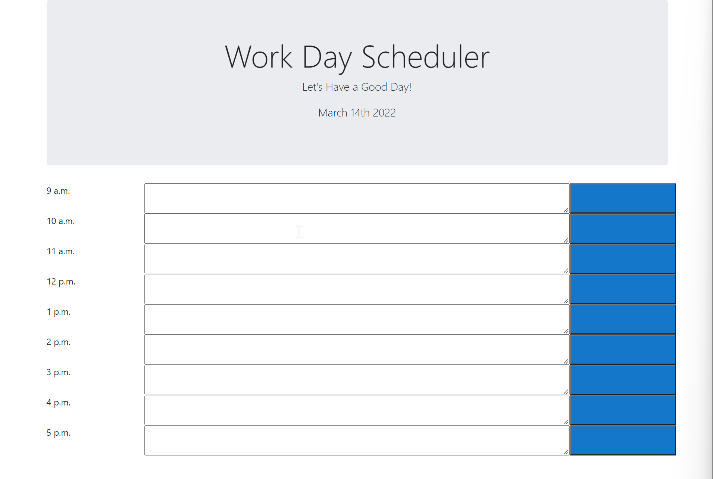

### Objectives

In this assignment I was meant to create a simple work day event calendar that utilized bootstrap for the styling and JQuery and momentJS to make it responsive with the time of day. It was intended so users would be able to enter events into the fields and have it save by saving the information for each day into the local storage. 

## Screenshot of Page

## Link to Page

[Link to Final Page](https://victorini1.github.io/EventCalendar/)